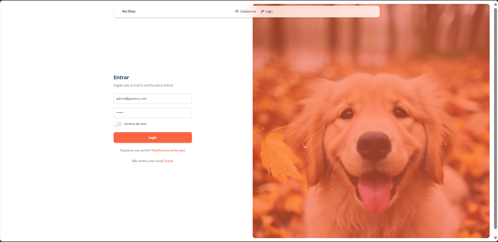
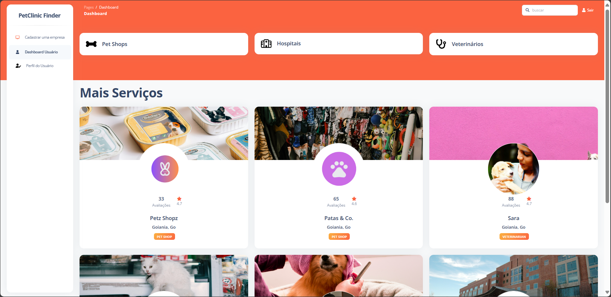

 


# Projeto Integrador - PetClinic Finder

  PetClinic Finder -Encontre Atendimento Veterinário em sua Região. 
  O projeto visa o desenvolvimento de uma aplicação que facilite o acesso dos proprietários de animais de estimação a serviços veterinários de qualidade em sua cidade. 
  A plataforma permite que os clientes se cadastrem e encontrem facilmente médicos veterinários, clínicas e hospitais veterinários cadastrados no sistema, filtrando por especialidade e localização.

## Tópicos
   * [Sobre o projeto](#sobre-o-projeto)
   * [O projeto PetClinic Finder](#o-projeto-PetClinic Finder)
   * [Instalando o projeto](#instalando-o-projeto)
      * [Pré-requisitos](#pré-requisitos)
      * [Preparando o ambiente](#preparando-o-ambiente)
   * [Executando o projeto](#executando-o-projeto)
      * [Passos iniciais após clonar o repositório](#passos-iniciais-após-clonar-o-repositório)
      * [Criando nova branch para desenvolvimento](#criando-nova-branch-para-desenvolvimento)  
   * [Estrutura Conceitual Externa](#estrutura-conceitual-externa)
   * [Tecnologias Utilizadas](#tecnologias-utilizadas)
   * [Autores](#autores)

## Sobre o projeto 

Apresentado ao Centro Universitário Senac, como exigência parcial para obtenção de aprovação na disciplina Projeto Integrador v, do curso de Análise e Desenvolvimento de Sistemas.

## O projeto PetClinic Finder

<h3 align="center">Login</h3>
<p align="center">

<p align="center">Entrar com e-mail de acesso e senha.</p>
</p>

<h3 align="center">Dasboard</h3>
<p align="center">

<p align="center"> Nesta página é possível realizar buscas pelos profissionais, hospitais e petshops mais próximos de você.</p>
</p>


<h3 align="center">Editar usuário</h3>
<p align="center">

<p align="center">Aqui o usuário consegue editar seus dados pessoais e da conta.</p>
</p> 

<h3 align="center">Cadastrar Empresa</h3>
<p align="center">

<p align="center">Nesta página é possivel cadastrar um serviço ou empresa.</p>
</p>


<h3 align="center">Card de avaliações</h3>
<p align="center">

<p align="center">Através das avaliações os usuários podem escolher os serviços oferecidos.</p>
</p> 

## Instalando o projeto 

### Pré-requisitos 

- <a href='https://sourceforge.net/projects/xampp/files/XAMPP%20Windows/8.2.4/xampp-windows-x64-8.2.4-0-VS16-installer.exe'>Xampp</a>: pacote que contém os componentes MySQL e PHP;
- <a href='https://getcomposer.org/Composer-Setup.exe'>Composer</a>: ferramenta de gerenciamento de dependências em PHP;
- <a href='https://www.heidisql.com/installers/HeidiSQL_12.5.0.6677_Setup.exe'>HeidiSQL</a>: utilizado para acessar o banco de dados.

### Preparando o ambiente 

1. Instale o Xampp;
2. Instale o Composer adicionando o PHP no patch do sistema operacional;
3. Instale o HeidiSQL.
> *Atenção*: para executar o Xampp é necessário executá-lo como administrador do sistema.

## Executando o projeto 

### Passos iniciais após clonar o repositório

1. Renomeie o arquivo '.env.example' para '.env';
2. Execute o comando ```composer install```;
3. Configure os dados do banco de dados dentro de '.env';
4. Execute o comando ```php artisan key:generate```;
5. Execute o comando ```php artisan migrate```;
6. Inicie o projeto através do comando ```php artisan serve```.

### Criando nova branch para desenvolvimento

1. Verifique a sua branch atual utilizando o comando ```git branch```;
2. Na branch main, use o comando  ```git checkout -b <nome_da_branch/#numero_da_issue_aberta>```.
<br> **Exemplo**: ```git checkout -b anotso/#1``` <br>
3. Use o comando ```git checkout main```; 
4. Na branch main, execute o ```git pull origin main``` **antes de iniciar o desenvolvimento de qualquer nova atividade**.
> Caso não exista issue aberta no repositório do projeto é só cria-lá. Caso seja destinada para um outro integrante é só informar no grupo e passar a URL para a pessoa.

## Estrutura Conceitual Externa

Foram desenvolvidos esboços com a ideia por trás do projeto, seguido pela fase escrita do <a href="https://docs.google.com/document/d/1m2EhhgLZO_s13yHRFUj9yRpd48kIsixteWzQSpkLH6U/edit#heading=h.cwnjb6nrl73l">Projeto Formal</a>. Com o uso da ferramenta Figma foi produzido um <a href="https://www.figma.com/design/Ly5DJGm8pCXOswr7nk8ZrL/PetClinic?node-id=7%3A16&t=dfagcNMjK5j2Acwl-1">Modelo Visual Interativo</a> a ser seguido no desenvolvimento de front end e para a produção técnica, foi utilizado múltiplos conhecimentos da equipe.

## Tecnologias Utilizadas

PHP 8.2, Laravel v10, banco de dados MySQL v8, Bootstrap v5, Jquery v3.8 e Font Awesome 6.


## Autores

<a href="https://github.com/Adassalifer">Adassa Jeanneffer Lima Ferreira</a><br>
<a href="https://github.com/carolinabranquinho/">Carolina Alves Branquinho</a>
<a href="https://github.com/daimainardi/">Daiane Bovolini Mainardi</a>
<a href="https://github.com/Anotso">Gracilliano Dos Anjos Carvalho</a><br>
<a href="https://github.com/dori18/">Isadora Clara Silva da Costa</a>
<a href="https://github.com/manoellasouza/">Manoella Souza</a>
<a href="https://github.com/MRBr4bo/">Marcos Roberto Brabo</a>
